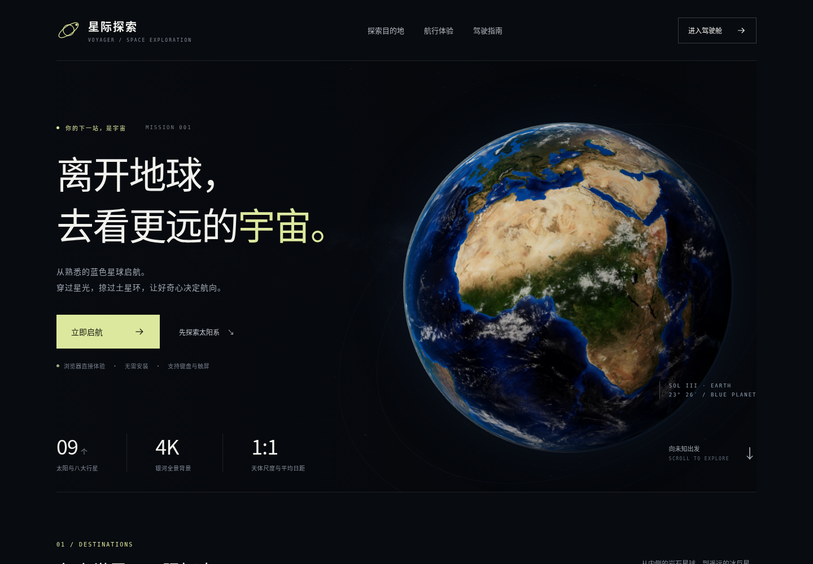
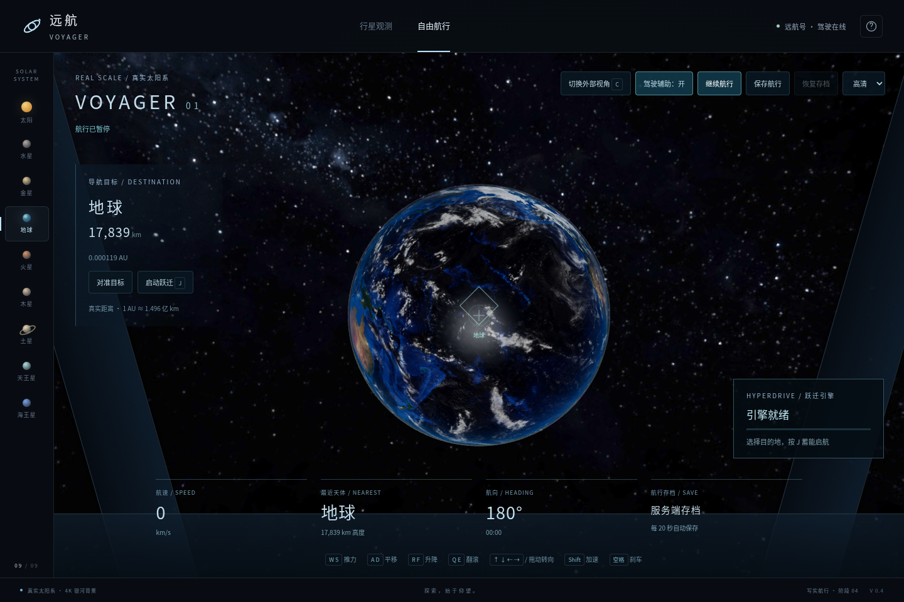
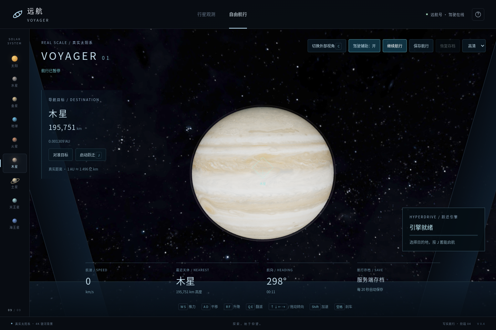
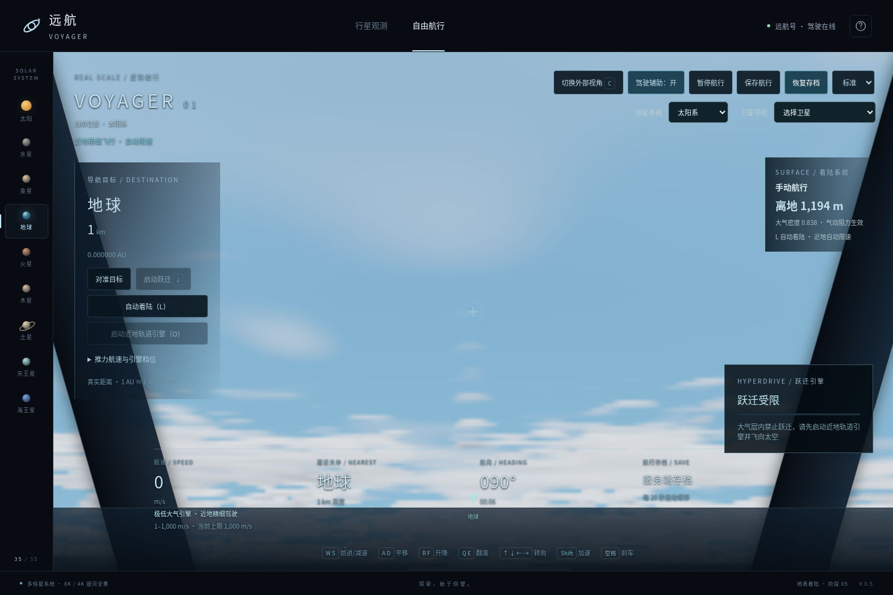
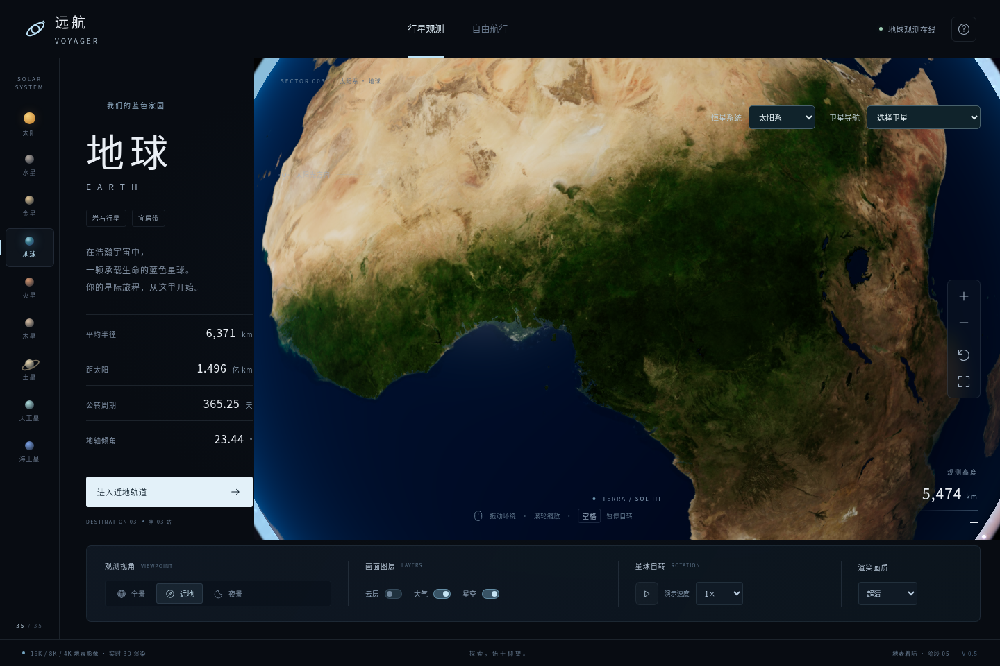
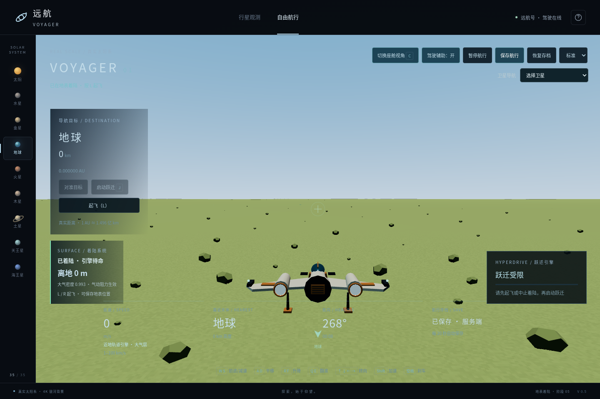
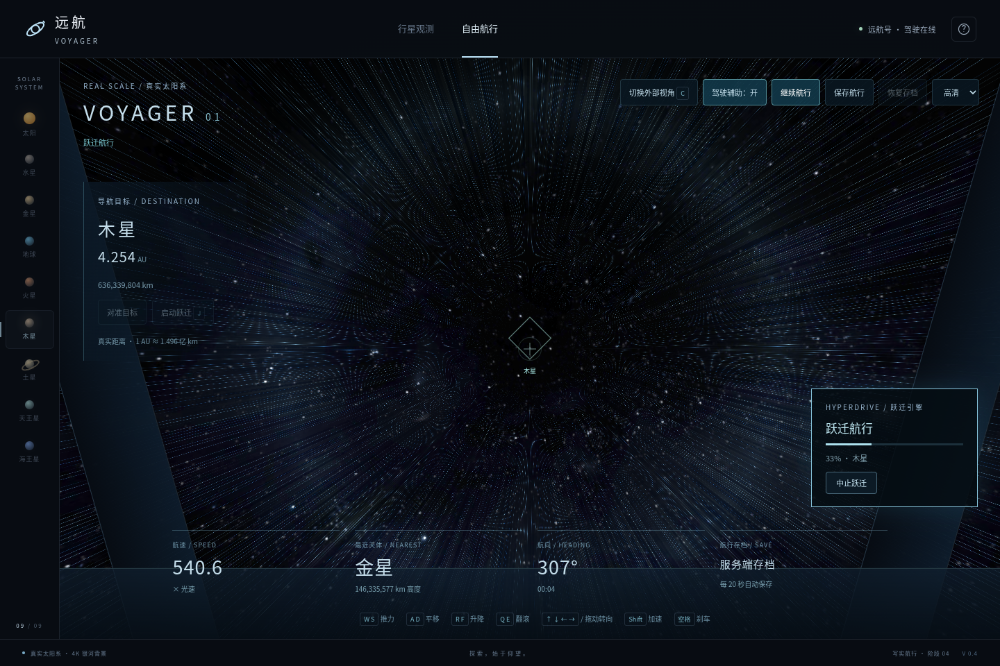

# 星际探索 · 远航 VOYAGER

网站源码和自动部署配置已加入仓库：每次推送到 `main`，GitHub Actions 构建首页与游戏并发布到 GitHub Pages。首次启用、在线存档和部署验证见 [网站发布说明](docs/WEBSITE.md)。公开地址在 Pages 启用且部署成功后为 `https://dns0129.github.io/space_exploration/`。



[查看手机网站首页](docs/screenshots/site-mobile.png)。

**阶段 06：落地离舱与星球徒步。** 在太阳系、半人马座 α 与参宿四的 3D 航区中驾驶飞船，环绕太阳和八颗行星，自由加速、平移、升降与翻滚；可使用座舱或外部视角。在固体星球着陆后，可以离开飞船步行、奔跑和跳跃，体验各天体不同的重力。现在使用原生 8192 × 4096 银河全景（紧凑/软件渲染设备使用 4K），太阳、行星、卫星与半人马座天体使用高清影像及独立程序化细节，近距离不再出现贴图马赛克；行星半径和平均日距保持真实比例。跃迁引擎提供蓄能、航道飞行、减速抵达和冷却；Node.js 后端保存航行和徒步状态，原有观测功能保留。

## 下载即玩

太阳系行星和谷神星已按参考轨道倾角与升交点方向分布在不同平面，小行星带也具有立体厚度。平均日距保持不变，卫星随母星移动，旧近景、着陆和徒步存档支持迁移；位置仍为静态示意，详见 [轨道与带区说明](docs/ORBITAL-EXPLORATION.md)。

最新离线 ZIP 包含精细飞船、独立程序星球、8K 银河与立体穿云/地表过渡。也可进入 [在线游戏](https://dns0129.github.io/space_exploration/game.html) 驾驶。

下载 [自由航行游戏包](https://github.com/dns0129/space_exploration/raw/refs/heads/main/downloads/voyager-warp.zip)，解压后将 **`voyager-warp.html`** 拖入 Chrome 或 Edge。点击顶部“自由航行”，再按 **W** 出发。

独立 HTML 内嵌全部程序、样式、16K 地球分块细节与 8K/4K 地球图层、原生 8K/4K 火星和月球、8K/4K 银河背景以及全部行星、卫星和半人马座天体的高清贴图，无需安装 Node.js 或联网即可驾驶；保存与恢复使用本机存档。浏览器需要 WebGL 2 与图形加速。

若直接链接未下载，可打开 [文件页面](https://github.com/dns0129/space_exploration/blob/main/downloads/voyager-warp.zip) 点击下载。旧 `voyager-flight.zip`、`voyager-solar-system.zip` 与 `voyager-earth.zip` 保留为前三阶段存档；写实空间和跃迁引擎请使用新版 `voyager-warp.zip`。





[查看手机驾驶画面](docs/screenshots/real-mobile.png)。

## 使用包内后端

游戏包同时包含可独立运行的后端。安装 **Node.js 24 LTS** 后，在解压目录运行：

```sh
node server/server.mjs --standalone
```

Windows 可双击 `启动航行.bat`；macOS/Linux 可运行 `bash 启动航行.sh`。服务启动后在本机浏览器访问 `http://127.0.0.1:3000/`，使用服务端保存、恢复航行。后端全部采用 Node.js 内置模块，无需 `npm install`。

存档保存在解压目录的 `data/` 中。每个浏览器通过一个 HttpOnly 会话 Cookie 识别自己的存档；刷新页面或重启服务器后可恢复同一浏览器的航行。关闭服务器使用 Ctrl+C。独立文件与服务器页面属于不同浏览器来源，各自的存档独立。

## 驾驶操作

| 操作                | 按键              |
| ------------------- | ----------------- |
| 前进推力 / 减速，停稳后倒车 | W / S             |
| 左右平移            | A / D             |
| 升降                | R / F             |
| 翻滚                | Q / E             |
| 转向、抬头与低头    | 方向键 |
| 加速                | 按住 Shift        |
| 刹车                | 按住空格          |
| 切换座舱 / 外部视角 | C                 |
| 启动跃迁引擎        | J                 |
| 启动近地轨道引擎    | O                 |
| 自动着陆 / 起飞 / 中止 | L               |
| 操作指南            | H                 |

落地后按 **E** 离舱；徒步时按 **W/A/S/D** 行走、**Shift** 奔跑、**空格** 跳跃，方向键或拖动场景观察四周，**C** 切换第一/第三人称。走回飞船附近并落地后按 **E** 返舱。空中的 E 仍是飞船翻滚；徒步期间 L、R 和 J 不会起飞或跃迁。手机使用“离开飞船”“返回飞船”和切换后的行走、奔跑、跳跃按钮。

飞船使用方向键转向，鼠标移动或拖动不会改变航向；打开帮助或暂停会释放操控。手机使用左侧推力、升降、平移与翻滚按钮，右侧转向和加速按钮，也可按住场景拖动，松手回正。点顶部“行星观测”返回原有观察模式。

驾驶手感参考《无人深空》的辅助飞行：转向平滑起落，驾驶辅助开启时速度方向逐渐跟随船头，转弯伴随侧倾，加速时视野逐渐展开；关闭辅助可保留惯性漂移。飞船使用原创后掠翼、双发动机舱与发光座舱模型，外部视角采用更近的追踪镜头。锁定标识按渲染帧实时跟随天体中心，离开视野显示方向箭头。

飞船使用独立近景渲染层，共用同一个画布和航向，不受太阳系大尺度深度范围导致的细节闪烁影响；静态船体按材质合并绘制。

点击天体导航选择目的地：**对准目标**调整飞船朝向，再施加推力前往；**启动跃迁（J）**开始蓄能，沿航道飞往目标，在星球仍很小时进入直线减速段，星球随实际距离连续放大，航道光效逐渐退去，最后停在星球附近并冷却。末段保持进入接近航段时的朝向和翻滚，不自动调平或转向地平线。抵达侧保留出发点相对目标的方向，跨系统也保留接近方向。岩石行星通常抵达约 1100 km 高度；巨行星按大气高度留出余量，土星保持在环系外，恒星保持安全距离。航程实际改变世界坐标，自动避开太阳、行星和卫星；可随时暂停或中止，退出航行保留当前位置。冷却后可再次跃迁。

驾驶辅助默认开启，使速度逐渐衰减；关闭后保持惯性滑行。暂停航行会冻结飞船，切换到后台时自动暂停。护盾会在接近行星或太阳时制动，高速运动也不会直接穿过行星。航速、最近天体、高度、航向、时间和目标距离实时更新。

仅在离固体地表 **10,000 m 以内**使用低速引擎。导航面板的“航速与引擎”提供滑块和数字输入，可手动选择 **1–1000 m/s**；按 W、平移或升降施加推力时达到所选速度上限。超过 10 km 后使用最低档为 **1 km/s** 的轨道或太空引擎，低速预设不再生效；仍在大气内时巡航为 **1 km/s**。空格可刹停，着陆后保持静止，起步正常加速。Shift 增加推力，不会突破限速，恢复高速存档也会立即限速。

离地 **超过 10,000 m**、船头朝向太空且没有向内漂移时，点击“近地轨道（O）”或按 O 显式启动近地轨道引擎。大气层内继续保持 1000 m/s 上限，离开大气后才开放太空推进；转向内侧会取消离地状态。太空常规推进在轨道/行星引擎之间随速度切换，最高 **10,000 km/s**；要达到 **100,000 km/s**，必须在“航速与引擎”里手动切换“星际高档”，按 Shift 不会自动换到高档。航速设置和引擎档位随存档保存。

距天体表面 1000 km 内保留近接安全区；真空安全区的手动推进在未启动向外离地时最高 100 km/s。大气限速优先于安全区和已启动的离地引擎，高速接近会检查整段路径并制动，不能跳过大气或近地限速层。所有大气内及 1000 km 内禁止跃迁，按钮与 J 使用同一规则。

卫星导航提供月球及木星 4、土星 8、天王星 5、海王星 8 颗主要卫星，共 35 个可观测、锁定和跃迁访问的天体。月球使用原生 8K / 4K 影像，其他 18 颗有探测器影像的卫星使用 4K（天卫二、天卫三、天卫四、土卫七为 2K）实测全球影像；海王星内侧 6 颗小卫星与海卫二没有可用的全球影像，改用 4K 高清概念图并分别调色、错开经度。天王星卫星和海卫一从未被拍到的半球，用已拍区域镜像填补作示意。半径和平均轨道距离使用真实公里比例，位置为静态轨道示意。小卫星的跃迁抵达点至少在表面 1100 km 外。

“恒星系统”选择太阳系或半人马座 α，天体导航随之切换。航行模式仅改变目标，按 J 才实际前往另一系统。半人马座包含黄白色南门二 A、橙色南门二 B、红色比邻星，以及比邻星 b、c、d。b 是已确认行星，c/d 在游戏中标为候选；系外行星的半径、地表和大气是美术/尺度示意，不是实测照片。三颗恒星使用基于 NASA/SDO 太阳影像的 4K 恒星概念图并按温度着色，比邻星 b/c/d 使用 4K 高清概念图（CC BY 4.0）。双星平均间距约 23.4 AU，比邻星为远伴星；固定坐标为示意布局。

“恒星系统”新增 **参宿四**：当前只建立一颗红超巨星，可观测、近观、锁定与跨系统跃迁，也可保存和恢复。半径采用约 764 个太阳半径（531,514,800 km）、温度约 3600 K、距离约 548 光年的估计值，参数仍有不确定性；航区布局为示意。表面使用原创 **8192 × 4096（8K）** 球面纹理，表现巨型对流胞、暗色下沉通道与细小颗粒；低内存/触屏或不支持 8K 的 GPU 使用 **4096 × 2048（4K）** 版本。表面不是实测照片，没有固体地面，不能着陆；暂未添加行星或伴星。参宿四复用 8K/4K 银河全景，并采用独立方向和亮度。

各恒星航区共享许可记录中的真实 8K 银河全景，并保留各自的观察方向与亮度；紧凑设备和软件渲染默认使用 4K。直接采样经纬全景，保留原始尘埃带细节，额外叠加随画面像素过滤的细小星点；星点是程序美术，不是天文星表。实际航区、光照和观察方向随跃迁及恢复存档变化。飞船采用恒星航区内坐标，跨系统方向按光年距离换算，接近天体时保留精度；存档携带航区标识，旧存档默认太阳系。可在跨系统跃迁中途取消并保存当前位置。

可手动保存或恢复位置、速度、朝向、目的地、视角、辅助状态与航行时间；每约 20 秒航行时间自动保存，退出航行时也保存。暂停或跃迁过程中不自动覆盖最近的检查点；途中可手动保存，恢复时停在所存位置，跃迁过程本身不续播。服务端不可用时使用本机存储。

## 精细飞船、程序星球与立体进入大气

飞船使用高细分曲面装甲、实体面板缝、倒角翼板、铆钉、曲线座舱框架、双涡轮发动机与液压起落架。静态船体按七种材质合并，双层软边尾焰随推力伸缩。恒星被天体遮挡时，船体主光与镜头辉光会同步变暗；高速向内穿越大气时出现随速度和空气密度变化的边缘气辉。

太空光照增加船体自遮挡与柔和投影，降低真空环境中的泛亮补光。恒星被行星遮住时，按光盘大小连续计算半影，船体主光和镜头辉光同步衰减；土星投向环系的长阴影按恒星角半径和像素范围柔化，环系投向球面的阴影使用光学厚度衰减。地球云影沿球面光线求交，减少晨昏处拖长的平面贴图感；所有效果由几何和着色计算，没有新增阴影贴图素材。

土星环采用冰粒薄层散射：D/C 环透光、B 环更密、A 环半透明，保留卡西尼、恩克和基勒缝隙以及细窄 F 环。观察倾角决定穿过环层的光程；受光面与背光面分别计算反射、透射散射，环影共用相同光学厚度。冰粒与尘埃的细密色差独立于环密度，条带和颗粒按像素足迹过滤；环系没有使用图片贴图，也没有夸大的实体厚度或巨石。环径按模型的平均半径换算，密度、成分和颗粒细节为物理参考的程序化示意。

42 个天体都以自身 ID 生成稳定、独立的程序种子，岩石陨坑、冰壳裂纹、气态条带、云气和恒星对流使用各自的形态参数。近距离程序细节支持最高 **32768 周向采样的频率层级（32K 级）**，按像素足迹过滤，保留实测/概念图的底色；这是程序化美术细节，不代表所有天体都拥有原生 32K 照片或每帧输出 32K 画面。地球继续使用原生 16K 影像分块。

地球天空使用分层分子/气溶胶散射，低空有深蓝天顶、浅色地平线和独立太阳盘；增加约 1.6–6.5 km 的低空积云、7.8–15.5 km 的入气云层以及 21 km 的薄卷云。局部体积云具有空间厚度、光照明暗和晨昏暖色，共用有界八步采样，云团法线复用噪声梯度。下降时从太空蓝色地平线连续进入天空、云层与地面，局部云与全球云层渐变衔接，近地地表用柔和远景雾控制清晰度。所有局部地形仍与碰撞共用高度函数。

进入大气或无大气固体天体的近地范围后，切换到独立星球内场景，只更新当地地表、天空、云和近景飞船；离开时恢复太空场景。太空模式的天体按屏幕尺寸创建，星球内暂停全球模型细节、云层旋转、地球分块更新与新增贴图解码/上传；低空高精地形按距离生成，高空仍有轻量地平线底层。切换带高度滞回，避免在边界反复创建资源。两种世界模式共用一个画布，近景飞船仍独立绘制。



## 超清地球



地球日面使用原生 **16384 × 8192（16K）** NASA Blue Marble 影像，云层、城市夜景和 GEBCO 地形图层升级到 **8192 × 4096（8K）**。使用显卡的桌面默认“超清”，软件渲染默认“高清”；近观时按视角加载 16K 分块，最多驻留四块；8K 全球图层在基础场景可用后逐张加载。触屏、低内存或不支持 8K 的设备保留 4K，细节下载失败也能继续观测。

桌面球面网格由 192 × 128 提升到 512 × 256，呈现轻微山脉起伏、海岸/湖泊边界、随光线变化的地形法线、海面反光、约 11 km 高云层和偏移云影。“超清”允许最高约 830 万画面像素（接近 4K）与 2 倍像素比，仍按性能调整；最终清晰度取决于窗口、屏幕和 GPU。近观增加的地表微纹理与云丝属于渲染细化，着陆局部仍为程序化游戏地形。

## 大气、地表与着陆

靠近并选择当前岩石行星或卫星后，点击导航面板的 **自动着陆（L）**。飞船连续下降、逐步减速、调平姿态并展开起落架，落地后固定在地表；按 **L** 或 **R** 启动起飞辅助，升至离地 2 km 后恢复手动驾驶。自动下降或起飞时，空格或任一手动操纵会中止辅助；暂停冻结进度。也可低速手动接触地表着陆。太阳、南门二 A/B、比邻星、参宿四及四颗巨行星不能地表着陆，巨行星导航会提示改选卫星。

地球、金星、火星、巨行星和土卫六具有各自的天空色、随高度递减的大气密度和飞行阻力。地球游戏大气边界为 160 km：100 km 已进入稀薄大气，可看到蓝色地平线、天空散射和逐渐淡出的星空；继续下降，天空与远处地表雾感逐步增强。天空按实际视线穿过大气的长度、所在恒星方向和昼夜变化，从太空连续过渡到大气，并在晨昏出现暖色散射。外部镜头在接近大气时保持在飞船附近的高度范围，垂直下降或爬升不会因追踪距离跳回太空。无大气的天体保留星空。视觉光学密度为参考《无人深空》的游戏美术参数，高空飞行阻力仍按稀薄空气计算，大气没有真实物理意义上的锐利边界。距固体地表 10 km 内使用 1–1000 m/s 手动低速档，超过后恢复最低 1 km/s 的引擎档位；大气内最高仍为 1 km/s。驾驶辅助开启时补偿近地重力，关闭后需自行提供升力。

70 km 内逐渐生成随飞船位置更新的宽范围曲面地形，地球包含公里级连续山脊、山谷、丘陵与高山积雪，近地使用更密的曲面网格并保留至少 100 km 的远山范围；其他天体包含柔和丘陵，所有地表具有远景雾、表面颗粒与不同天体配色；地形和碰撞使用同一连续高度函数。仪表显示离地米数、相对大气密度及着陆阶段。地表属于程序化游戏地形，不是真实测绘数据，地球局部地表也不按全球影像区分海陆。已着陆的位置、姿态与状态可保存和恢复；途中保存恢复为当前位置的手动驾驶，不自动续播下降或起飞。



## 星球徒步与重力

飞船在固体地表停稳后，点击 **离开飞船（E）**，人物从停泊点旁出舱，飞船保持原地。地表探索提供宇航员第三人称模型和第一人称视角，行走跟随当前朝向，脚底碰撞与可见地形共用高度函数；在坡面移动和落地时不会穿过地面。徒步仪表显示步速、重力、与飞船的距离及落地/腾空状态。徒步场景使用 **24 m 地表登陆艇** 作为返舱入口的游戏比例表现，飞行船停泊坐标不变。

各天体使用自己的重力加速度：地球 **9.81 m/s²**、月球 **1.62 m/s²**、火星 **3.71 m/s²**、土卫六 **1.35 m/s²**。相同的 **4.5 m/s** 起跳速度下，重力越小，跳得越高、腾空越久；空中惯性和方向修正也参与运动。按住空格只跳一次，落地后需松开再按。极低重力天体使用宇航服回落辅助，避免一次跳跃长时间无法回到地面；仪表仍显示该天体的重力参数。以上为简化的游戏物理与探索示意，没有生命保障、氧气消耗或真实天气模拟。

人物落地且距离停泊点不超过 **12 m** 时，按 **E** 或点击 **返回飞船** 返舱；远处无法远程进入飞船。返舱后可按 L/R 起飞。徒步时屏蔽飞船推力、翻滚、对准目标和跃迁，避免探索中误操纵停泊的飞船。暂停同时冻结人物与飞船；手动保存、自动保存和退出航行都会保留徒步位置、速度、朝向、视角与腾空状态，恢复后继续探索。旧航行存档保持可用。

## 开发运行

需要 Node.js 24 LTS 与 npm。无需数据库、API 密钥或外部素材服务。

```sh
cd /workspace/space_exploration
npm ci
npm run dev -- --port 5173 --strictPort
```

该命令同时启动后端（默认本机 3000）和 Vite（5173），Vite 将 `/api` 请求代理给后端。可通过 `VOYAGER_API_PORT` 更改开发后端端口。云环境内部地址仅供开发验证，不是用户可访问的公开站点。

```sh
npm run build        # TypeScript 检查与生产构建，输出 dist/
npm run build:site   # 网站首页和在线游戏，输出 dist-site/
npm run test:site    # 部署路径下的桌面/手机网页、驾驶、存档和版本更新验证
npm start            # 后端同时提供 dist/ 游戏页面与 API，默认本机 3000
npm test             # 桌面与移动浏览器功能和实际渲染验证
npm run test:server  # HTTP、持久存档、输入验证和航行动力学检查
npm run export       # 生成独立 HTML 及包含后端的 ZIP
npm run test:offline # 导出并验证断网驾驶、跃迁、本机保存与恢复
```

后端可通过 `PORT` 修改端口、`VOYAGER_HOST` 修改绑定地址、`VOYAGER_DATA_DIR` 修改存档目录。生产模式直接用 `npm start` 提供页面与 API；Vite preview 仅预览静态构建，不包含存档后端。

## 后端接口

| 接口                    | 功能                             |
| ----------------------- | -------------------------------- |
| `GET /api/health`       | 服务状态                         |
| `GET /api/world`        | 42 个天体、恒星系统坐标与驾驶参数 |
| `GET /api/flight/save`  | 当前浏览器的航行存档             |
| `POST /api/flight/save` | 校验并保存当前航行状态           |

保存请求必须是 JSON，大小不超过 8 KiB；校验坐标、速度、单位四元数、目的地等字段。存档按会话隔离，写入使用临时文件和原子替换，同一会话的写入按顺序完成。后端负责配置与持久保存，浏览器实时计算驾驶和碰撞，保持控制响应。

## 真实尺度与画面范围

世界坐标使用双精度数值，1 个内部长度单位等于 6371 km。太阳半径为 695700 km，地球半径为 6371 km、日距为 1 AU（149597870.7 km），海王星平均日距为 44.951 亿 km；其余行星同样采用真实平均日距与平均半径。渲染时将坐标原点移到飞船附近，使用对数深度和远处低细分模型，避免大范围坐标下的抖动和深度冲突。超过像素分辨率的远小天体不放大成装饰球体。

目的地跨恒星系统时显示光年，系统内远距离显示 AU 和公里，近时显示公里；超光速航行期间显示光速倍数。飞船船体长 10 km，与星球共用公里尺度；相对地球直径 12742 km 约为 0.0785%。世界与独立船体渲染层使用同一比例，外部镜头拉远，让飞船保持较小的画面占比。接近地表时，参考点移到起落架并使用近地观察镜头，完整船体保持原尺度。普通航速仍为游戏参数，远距离跃迁蓄能、飞行及减速抵达共约 12 秒。

银河是原生 8K 球面全景背景，兼容版本为 4K，并非可以穿越整个银河的三维星系。地球采用原生 16384 × 8192 NASA 日面影像、8K 云层/夜景/地形及 4K 设备兼容版；火星和月球恢复原生 8192 × 4096（8K）影像，触屏、低内存、GPU 不支持 8K 或下载失败时使用原生 4096 × 2048（4K）版本；太阳、水星、金星（云顶）、木星、土星和海王星为 4096 × 2048 贴图；天王星本身几乎没有可见特征，公开许可的最高版本为 2048 × 1024。卫星和半人马座天体的分辨率与“实测/概念”标注见 [ASSETS.md](ASSETS.md)，素材来源、作者、许可和 SHA-256 记录在 `public/textures/provenance.json`，可用 `scripts/prepare-body-textures.py` 重新下载核对。

近距离贴图被放大时使用双三次（B 样条）过滤代替逐像素方块，经度接缝按两套梯度取较小值，避免接缝处降级；地形起伏按纹理空间差分计算每个像素的法线，不再出现 2×2 屏幕块状阴影；超过贴图分辨率后叠加随距离淡入的程序化细节（岩石颗粒、云边、条带），远处自动消失，不改变原图配色。地球保持原有深蓝色 Blue Marble 图层：近地轨道的独立云层与远景合并云层使用同一中性白光着色，不再被太阳色染黄；开阔海面放大时读取 8×8 平均后的层级，去除原图 JPEG 方块。大气外壳略大于解析大气边界，远距低细分网格不会切出折线；有显卡时开启多重采样抗锯齿，分辨率自适应的下限提高到 50%。大气使用八点视线密度采样、地表遮挡、日落染色与前向散射；近处天空和远处大气壳共用散射算法与公里高度，进入大气不再关闭辉光。地球云层约 11 km 高并投射随云移动的简化阴影。

火星、卫星、恒星和系外行星贴图在天体接近到几个像素以上、被选为导航目标或进入观测时才下载，先显示程序化材质再淡入影像；最近未看到的贴图在超过 6 张（低内存或触屏设备 3 张；火星、月球和参宿四保留 4K，其余以 2K 副本上传）时释放显存。

行星方向采用固定示意布局，日距为平均值，不是实时星历。近地加入简化局部重力与大气阻力；未模拟真实轨道力学、天气或多人联机。天体影像来自不同时间的观测与加工，均为静态贴图；推进、护盾与跃迁是简化、虚构的游戏机制。

同一浏览器来源或沿用 `data/` 目录时，读取到的旧版本压缩世界存档会自动迁移：按原位置相对目标行星的比例映射到新空间，保留视角、朝向、辅助设置和航行时间，速度归零。旧包中的存档格式与旧包运行程序保留不变。



## 验证与结构

浏览器测试使用 Chromium，检查实际渲染像素和驾驶操作，而非仅检查界面出现。无显卡环境使用 SwiftShader；其帧率不代表用户显卡。可用 `PLAYWRIGHT_CHROMIUM_EXECUTABLE` 指定 Chromium，或执行 `npx playwright install chromium`。

渲染以 60 Hz 帧预算为目标，超清/高清/标准分别限制约 830/210/120 万画面像素，按持续帧耗时降低分辨率，有显卡时最低保留 50% 分辨率，健康帧持续 3 秒后逐步恢复；大贴图上传造成的单帧停顿不计入；画面静止（暂停且镜头不动）0.4 秒后恢复完整分辨率。有显卡时天体贴图使用设备支持的最高倍各向异性过滤。五档球面网格按屏幕像素占比选择，停止绘制低于像素大小的天体及不可见云层/日冕。小尺寸地球合并云层着色；软件渲染允许更低的 3D 分辨率以保持操作响应，界面文字保持原分辨率。`npm run test:performance` 测量桌面和手机视口下地球、火星及木星近轨道的平均 FPS 与 P95 帧耗时，结果写入 `test-results/performance/metrics.json`。独立显卡电脑可加 `-- --hardware` 使用系统图形后端。实际表现取决于设备、图形加速与负载。六个近轨道场景的帧耗时与分辨率记录见 [性能验证报告](docs/PERFORMANCE.md)。

星球内暂停且镜头稳定时，恢复完整分辨率后复用画布，停止重复的世界与船体 GPU 绘制；仪表和输入继续响应，恢复航行或改变相机、画质、视口、存档时重新绘制。

云浏览器策略阻止 `file://` 导航；离线验证在普通浏览器来源中载入导出的完整 HTML，再断网测试，不绕过文件策略，也未验证在云浏览器中双击文件的系统行为。

- `src/planet-scene.ts`、`src/render-mode.ts`：共用画布与渲染器，独立的太空和星球内场景，每帧只绘制一个世界场景；带高度滞回的模式切换及按需天体资源管理。
- `site.html`、`src/site.ts`、`src/site.css`：网站首页、目的地导航与驾驶入口。
- `src/site-version.ts`：已打开页面的新部署提示和刷新。
- `src/planet-models.ts`：天体着色器，支持航行世界中的位置与尺寸。
- `src/atmosphere.ts`：太空与近地共用的大气视线积分、光学密度、昼夜和日落散射。
- `src/surface-scene.ts`、`src/entry-clouds.ts`、`shared/surface.mjs`：独立星球内地平线、近地曲面地形、多层云、天空、地表碰撞与大气参数。
- `src/ship-dynamics.ts`：推力、六轴运动、惯性、防撞、跃迁阶段和路线避让。
- `src/walking-dynamics.ts`、`src/explorer-view.ts`：米制徒步运动、各天体重力、跳跃碰撞、宇航员模型与地表返舱入口。
- `src/flight-controls.ts`、`src/flight-ui.ts`：键盘与触屏驾驶与仪表。
- `src/ship-model.ts`：外部飞船模型与引擎尾焰。
- `src/warp-effect.ts`：跃迁星光、航道和视场效果。
- `src/flight-store.ts`：服务端存档与本机回退。
- `shared/`：前后端共用世界配置及航行状态校验。
- `server/`：HTTP 服务、静态游戏页面、持久保存与测试。
- `scripts/`：开发启动、独立导出与离线验证。
- `src/body-textures.ts`：各天体的贴图、实测/概念标注、起伏与细节参数。
- `public/textures/`：全部天体高清贴图，来源见 [ASSETS.md](ASSETS.md)；`scripts/prepare-body-textures.py` 按固定版本下载、校验和处理。
